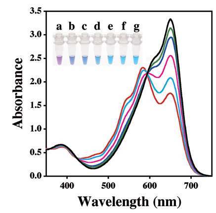

# HNB - hydroxy naphthol blue

Figure 1. Effect of Mg2+ ion concentration on the
spectra of HNB in the LAMP reaction solution. (A)
Absorption spectra of HNB in the LAMP reaction
solutions with various Mg2+ ion concentrations.
Mg2+ ion concentrations: red line, 8 mM;
cyan line, 7 mM; magenta line, 6 mM; blue line,
5 mM; green line, 4 mM; and black line, 0 mM.
A photograph in the graph shows the true color
of HNB in the reaction solution. Tube a, 8 mM
Mg2+ ions without dNTPs; tube b, 8 mM Mg2+
ions with dNTPs; tube c, 7 mM Mg2+ ions; tube
d, 6 mM Mg2+ ions; tube e, 5 mM Mg2+ ions;
tube f, 4 mM Mg2+ ions; and tube g, 0 mM Mg2+
ions. From: Goto et al. 2009.

## References

Goto M, Honda E, Ogura A, Nomoto A & Hanaki K-I. “Colorimetric Detection of
Loop-Mediated Isothermal Amplification Reaction by Using Hydroxy Naphthol Blue.”
*BioTechniques 46*, no. 3 (March 2009): 167–72.
https://doi.org/10.2144/000113072.
